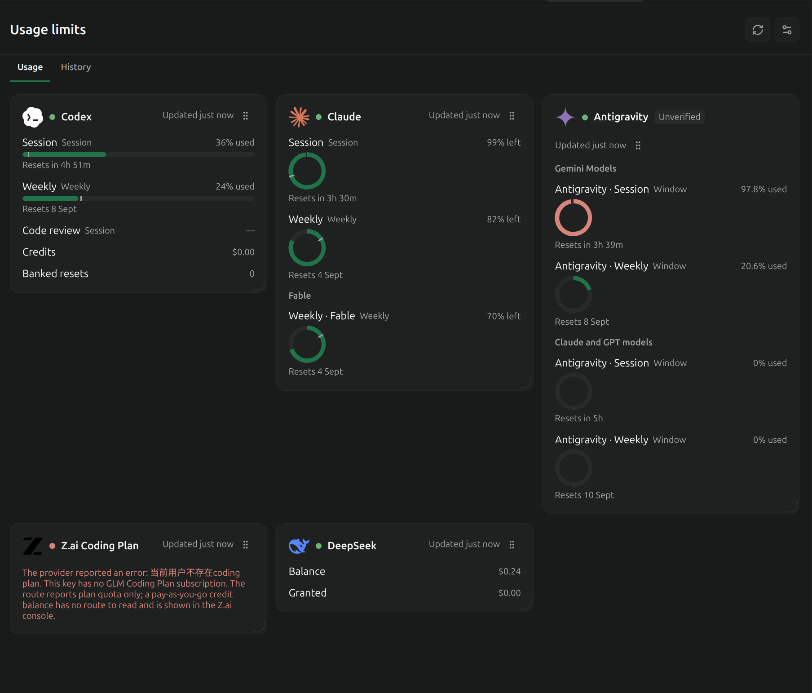
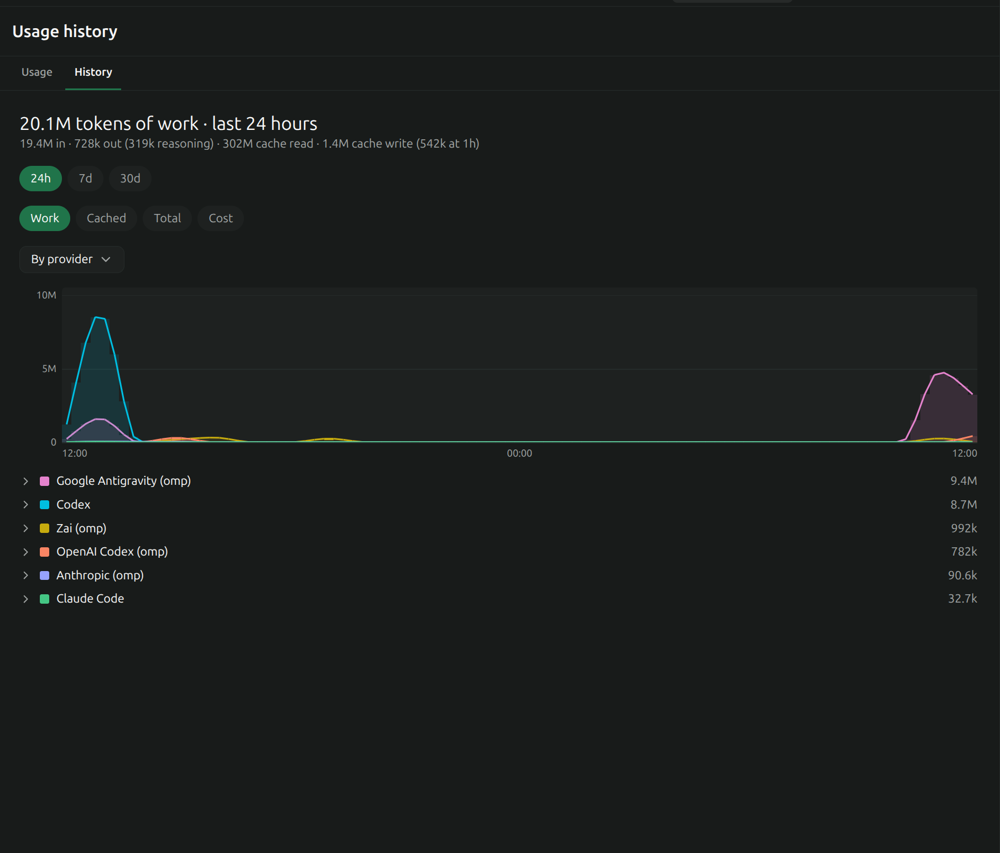

# Usage Monitor (usage-monitor)

A local Paseo plugin that answers two questions: _how much of my quota is left right now_, and _how many tokens have I burned over the last month_.

## What it contributes

Three sidebar surfaces.



**Usage Monitor** — live provider state, one card per configured provider. Each card renders its readings as bars:

- **quota** — used against a ceiling inside a resetting window (Claude's 5-hour and weekly buckets, per model family). The bar fills as you consume. Where a window has both a reset time and a duration, the bar also marks where even consumption would be, so you can see whether you are ahead of or behind pace.
- **balance** — money or credits left, optionally against a starting total so a percentage means something.
- **rate** — which pricing band is in force right now (peak vs off-peak) and when it changes.

Colour follows the same thresholds as Paseo's own provider meters. A quota over 90% consumed is danger, at or above 70% is warning, below that is neutral. A balance is coloured off what _remains_, inverted: under 10% remaining is danger, under 30% is warning.

A provider that fails to resolve or fails to fetch stays on screen as an error row. It never silently disappears.

Cards are reordered by dragging the grip on the right of a card header, or with the `Move earlier` and `Move later` accessibility actions. Dragging an edge or the corner resizes one card: the right edge changes width, the bottom edge height, the corner both. How a card _renders_ is a provider setting rather than a control on the card itself - see [Card appearance](#card-appearance).

A card can also carry a `notice`: one line saying why its readings are not current. A rate-limited provider keeps its last good readings with their original timestamp and explains itself in the notice rather than discarding real numbers — the surface shows it in the warning colour and marks the card stale. A provider whose credential was rejected does the same. A notice can accompany either a healthy-but-stale card or an error row, so it is independent of `status`. See [Rate limits](docs/PRESETS.md#rate-limits) and [Expiry](docs/CREDENTIALS.md#expiry).



**Usage history** — cumulative token usage over time as a stacked chart, switchable between 24h, 7d, and 30d. By default each series is one agent CLI. A provider row expands in place to show the models it ran, so the model breakdown appears beside everything else rather than replacing the view; several providers can be open at once. Grouping by model instead lifts every model to the top level, which is the only way to compare two models you reach through different tools.

Series colour is derived from the active theme's accent rather than fixed, so it survives a theme change. Hue separates providers and lightness separates the models inside one provider, which keeps an expanded provider reading as a family instead of as new categories. Every colour is held above the WCAG non-text contrast floor of 3:1 against all three surface colours — see [Colour](docs/HISTORY.md#colour).

It plots **Work** (input + output tokens) by default, with Cached, Total and Cost also selectable. Cache re-reads are 99.5% of the raw token total on real transcripts, so a single "tokens" figure reads as work performed when it mostly is not — see [Which metric, and why work is the default](docs/HISTORY.md#which-metric-and-why-work-is-the-default). Cost prices each turn from the vendor's own reported figure where a log carries one and from a cached public rate table otherwise, and says which — see [Cost](docs/HISTORY.md#cost).

**Usage providers** — add, edit, test and remove providers from inside the app instead of hand-writing JSON. It writes the same config file, and a key you type goes into a separate owner-only secrets file rather than into the config. See [Editing providers from the app](#editing-providers-from-the-app).

## Install

Plugin code is trusted and unsandboxed. The server half runs in a subprocess with full access to the daemon machine — its files, processes, credentials, and network. Read a plugin before you install it.

### 1. Get the code

```bash
git clone https://github.com/ABorakati/paseo-usage-monitor.git
cd paseo-usage-monitor
npm install
npm run typecheck
```

`npm install` only fetches the type declarations used by `typecheck`; the daemon compiles the plugin itself and needs nothing from `node_modules`.

### 2. Register it with Paseo

Either from the app or from the terminal. Both write the same entry to the daemon config.

**From the app (Settings > Plugins):**

1. Turn on **Enable plugins**. This is the global switch; nothing loads while it is off.
2. Paste the absolute path to the checkout into **Plugin directory** (for example `/home/you/paseo-usage-monitor`).
3. Leave **Plugin installation ID** blank so it takes `usage-monitor` from `paseo-plugin.json`.
4. Click **Install directory**.

The plugin appears in the list with a **running** badge. The same row has **Reload**, **Disable**, **Remove** and **Logs**.

**From the terminal:**

```bash
paseo plugin install .
```

Either way, if the plugin does not show as **running** within a few seconds, run `paseo daemon restart` and check again. The daemon occasionally needs a restart to pick up a newly added plugin entry.

### 3. Find it

Once running, the plugin shows up in three places:

- **Left sidebar** — two entries, **Usage Monitor** (gauge icon) and **Usage history** (chart icon). These open full-width surfaces.
- **Workspace tab** — inside any workspace, the tab picker lists **Usage Monitor** and **Usage history** alongside Terminal, Files and the other built-in tabs. They can also be dropped into the **Explorer** side panel.
- **Command palette** — `Open Usage Monitor`, `Open usage history`, and the `... in Explorer` variants of each.

The dashboard reads Claude Code and Codex out of the box with no configuration, using the credentials those CLIs already store. Adding anything else is done from the settings icon in the top right of the Usage Monitor surface; see [Editing providers from the app](#editing-providers-from-the-app).

### After editing

`paseo plugin reload usage-monitor` (or **Reload** in Settings > Plugins) picks up edits to the plugin's own TypeScript. It does **not** reload `usage-limits.json` — provider config is read per request, so a config edit takes effect on the next refresh.

## Supported providers

34 presets ship with the plugin, in five kinds. Which kind you get is the vendor's decision, not this plugin's: an ordinary API key that can read its own balance is the exception, and most frontier labs gate usage behind an admin credential or expose it only in per-request headers.

| Kind             | What it reads                                                                          | Presets                                                                                                                                                                                                                            |
| ---------------- | -------------------------------------------------------------------------------------- | ---------------------------------------------------------------------------------------------------------------------------------------------------------------------------------------------------------------------------------- |
| **Subscription** | Consumption inside a resetting window, from the CLI's own login or a plan-specific key | `claude`, `claude-statusline`, `codex`, `cursor`, `grok`, `github-copilot`, `kimi`, `minimax`, `minimax-cn`, `zai-coding-plan` (alias `zai`), `zhipuai-coding-plan`, `synthetic`, `opencode-go`, `chutes`, `zenmux`, `antigravity` |
| **Balance**      | Money or credits left on an ordinary API key                                           | `deepseek`, `moonshot`, `moonshot-cn`, `siliconflow`, `siliconflow-cn`, `stepfun-ai`, `stepfun`, `novita`, `deepinfra`, `venice`, `xai`, `nano-gpt`, `poe`                                                                         |
| **Aggregator**   | Spend against a cap, per key or per account                                            | `openrouter`, `openrouter-credits`, `vercel`                                                                                                                                                                                       |
| **Pricing band** | Which rate is in force now, from a schedule and no request                             | `deepseek-rate`                                                                                                                                                                                                                    |
| **Template**     | A shape to repoint once the vendor ships an endpoint                                   | `opencode-zen`                                                                                                                                                                                                                     |

Every endpoint, credential chain and caveat is in [Presets](docs/PRESETS.md), along with the list of vendors that cannot be read and why. Anything with a JSON endpoint, a CLI that prints JSON, or a file on disk can be added as a hand-written provider without a code change; see [Configuration](docs/CONFIGURATION.md) and [Recipes](docs/RECIPES.md).

## Editing providers from the app

The **Usage providers** sidebar surface adds, edits, tests and removes providers without opening an editor. It is a front end to the file documented in [Configuration](docs/CONFIGURATION.md), not a parallel system: it writes the same `${PASEO_HOME:-~/.paseo}/usage-limits.json`, in the same shape, and a config you wrote by hand shows up in it unchanged.

### Card appearance

Four things about how a provider draws live in the same editor as the provider itself, because they are properties of that provider rather than of the session you happen to be in. They persist to `display` in `usage-limits.json` and survive a reload.

| Setting           | Choices                          | Stored as                                    |
| ----------------- | -------------------------------- | -------------------------------------------- |
| Icon & brand mark | Default, Lucide, Monogram, Image | `display.icon`, absent for the built-in mark |
| Meter             | Bar, Ring                        | `display.style`, absent for Bar              |
| Quota reads       | Used, Left                       | `display.value`, absent for Used             |
| Readings per row  | not settable - measured          | nothing                                      |

A default is stored as **absence**, not as a value: choosing Bar removes `display.style` rather than writing `"bar"`, because both renderers already read a missing key as the default. A config that stores every default would be longer without saying anything more.

**Readings per row is not a preference.** The card measures itself and divides its own inner width by the narrowest a reading may become before it stops being readable, capped between one and four columns. Resizing a card therefore reflows it immediately, and a wider card shows more per row without anyone setting a number. The consequence worth knowing: two cards of different widths show different column counts, which is the point - the count describes the card, not the provider.

A `columns` key written by an older version of this plugin parses and is dropped on the next write. Nothing reads it.

### Where a typed key goes

A key you type into the UI is **never written into `usage-limits.json`**. It goes into a sibling file:

```
${PASEO_HOME:-~/.paseo}/usage-limits.secrets.json
```

created with owner-only permissions (mode `0600`). The provider entry in the main config then references it as an ordinary `jsonFile` credential — exactly the mechanism a hand-written config uses. Nothing about the result is special-cased, which means you can read the config afterwards and understand it, and you can hand-edit a provider the surface created.

The main config therefore stays safe to read aloud, paste into an issue, or commit. The secrets file is the one file to keep to yourself.

When a preset already declares an environment-variable source, the surface keeps that source **first** in the chain and appends the stored-secret source after it. An env var you have exported still wins, so adding a key through the UI does not silently override the way you were already authenticating.

### Stored secrets are write-only

A stored secret is never sent back to the UI. The form shows it as `stored` with a replace action, so the value cannot be read back out through the surface it was typed into. Three behaviours cover everything:

| You submit        | Result                        |
| ----------------- | ----------------------------- |
| The field omitted | Existing secret is preserved. |
| A non-empty value | Existing secret is replaced.  |
| An empty value    | Stored secret is deleted.     |

### Test before you trust

Each provider has a **Test** action. It builds a one-provider service and reads it once, bypassing the cache, reporting whether it succeeded, a message, and **how many readings came back**. On success the message also names the reading ids it resolved, so you can see which of your mappings actually produced something.

That reading count is the part worth watching: a provider can succeed and still return nothing useful, which is what wrong JSON paths look like. A test that reports `ok` with zero readings means the request worked and the paths do not match.

### RPCs

The surface talks to four handlers, should you want to find them in the code or call them yourself:

| RPC                            | Does                                                                                                  |
| ------------------------------ | ----------------------------------------------------------------------------------------------------- |
| `usage.config.read`            | Returns the config, the two paths, preset summaries, and which credential names have a stored secret. |
| `usage.config.write-provider`  | Writes one provider entry plus any secret values, and returns the new state.                          |
| `usage.config.remove-provider` | Removes one provider by id and returns the new state.                                                 |
| `usage.config.test-provider`   | Reads one provider once and returns `ok`, a message, and a reading count.                             |

Every write returns the whole new state rather than an acknowledgement, so the surface can never drift from the file.

## Defaults

With no `usage-limits.json` at all, the plugin reads the two local agent CLIs:

```json
{
  "claude": { "preset": "claude" },
  "codex": { "preset": "codex" }
}
```

Both authenticate from files the CLIs already wrote, so this works with no setup on a machine where you have logged into Claude Code or Codex.

To opt out, create the file. Defaults apply only when it is absent, so any file you write replaces them wholesale — a file listing only `my-gateway` yields only `my-gateway`. To keep an entry in the file but silenced, set `"enabled": false`.

## Documentation

| Guide                                      | Covers                                                                                                                     |
| ------------------------------------------ | -------------------------------------------------------------------------------------------------------------------------- |
| [Configuration](docs/CONFIGURATION.md)     | `usage-limits.json`: the provider map, provider entries, preset merge rules, readings, sources, JSON paths                 |
| [Credentials](docs/CREDENTIALS.md)         | Credential chains, expiry, and reading Claude quota without a token                                                        |
| [Presets](docs/PRESETS.md)                 | The 34 presets, per-preset caveats, what is unverified, what is not supported, Antigravity, GitHub Copilot, rate limits    |
| [Multiple accounts](docs/MULTI_ACCOUNT.md) | Two logins on one provider: arbitrary ids, the Provider id field, per-id secrets, a two-Codex recipe                       |
| [Recipes](docs/RECIPES.md)                 | Complete `usage-limits.json` files: env keys, hand-written HTTP, a CLI command, a schedule-only rate, an `each` projection |
| [Usage history](docs/HISTORY.md)           | Where the token history comes from, buckets, dedup, colour, metrics, cost, scan failures                                   |
| [Troubleshooting](docs/TROUBLESHOOTING.md) | Error rows, rate limits, expired credentials, null readings, command sources, history gaps                                 |

## License

MIT. See [LICENSE](LICENSE).
